# Lab 1: Enterprise Edge Isolation & Firewall Enforcement

## Overview
This lab implements an enterprise edge network architecture virtualized within GNS3, utilizing a pfSense Edge Firewall, a VyOS Core Router, and dual isolated Ubuntu Linux subnets. The project focuses on core networking fundamentals including inter-VLAN routing, Path MTU Discovery (PMTUD) troubleshooting, static route propagation, and protocol header analysis.

---

## Network Architecture & Topology

* **Objective:** Design a secure, multi-zone enterprise network that isolates administrative management systems from core application workloads while maintaining monitored internet connectivity.
* **Architecture Breakdown:**
  * **Edge Defense Layer:** A pfSense perimeter firewall managing external connectivity (WAN) and performing Network Address Translation (NAT) to protect internal hosts.
  * **Core Routing Layer:** A VyOS core router operating at Layer 3 to handle inter-VLAN routing and enforce traffic boundaries between distinct network segments.
  * **Isolated Internal Subnets:**
    * **Management Zone (VLAN 10):** Dedicated network segment (`192.168.10.0/24`) for administrative operations.
    * **Application Zone (VLAN 20):** Isolated network segment (`192.168.20.0/24`) for application workloads, configured with a constrained **1400 MTU** to analyze Path MTU Discovery (PMTUD) behavior.

---

## Core Routing & Gateway Configuration

* **Objective:** Configure the VyOS core router with Layer 3 IP gateways for all internal subnets, set non-standard MTU limits for traffic control testing, and establish a default route toward the edge security perimeter.
* **Key Implementation Details:**
  * **Transit Interface:** Assigned `10.0.0.2/24` to `eth0` to establish the backbone interconnect with the pfSense firewall.
  * **Management Gateway:** Provisioned `192.168.10.1/24` on `eth1` with standard Ethernet framing (**MTU 1500**).
  * **Application Gateway & MTU Tuning:** Provisioned `192.168.20.1/24` on `eth2` and clamped the interface to **MTU 1400** to enable downstream Path MTU Discovery (PMTUD) analysis.
  * **Default Outbound Route:** Configured static default route (`0.0.0.0/0`) directing all external traffic to next-hop gateway `10.0.0.1` (pfSense LAN interface).

### Core Interface Verification & VLAN Binding

* **Objective:** Verify operational state (`u/u`), IP address bindings, and MTU values across all active core router interfaces using the CLI operational output.
* **Key Implementation Details:**
  * **Interface Operational State:** Confirmed `u/u` (Admin Up / Link Up) status for active data paths (`eth0`, `eth1.10`, `eth2.20`, and `lo`).
  * **VLAN Tagging & Subinterface Structure:**
    * **`eth1.10`:** Subinterface bound to Management VLAN 10 (`192.168.10.1/24`) operating at standard **1500 MTU**.
    * **`eth2.20`:** Subinterface bound to Application VLAN 20 (`192.168.20.1/24`) explicitly configured to **1400 MTU**.
  * **Transit Interface:** Confirmed `eth0` is operational with transit IP `10.0.0.2/24` and standard **1500 MTU**.

---

## Host-Level Network Provisioning

### Management Server Network Addressing & Routing

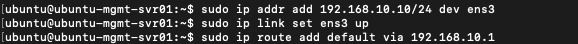

* **Objective:** Assign static Layer 3 networking to the Management host (`ubuntu-mgmt-svr01`) within VLAN 10 and establish default routing back to the VyOS core gateway.
* **Key Implementation Details:**
  * **Static IP Provisioning:** Configured `192.168.10.10/24` on interface `ens3` to place the server in the Management VLAN segment.
  * **Interface Activation:** Brought the network interface operational state to **Up** (`sudo ip link set ens3 up`).
  * **Default Route Forwarding:** Directed all off-subnet traffic to the VyOS core router gateway interface (`192.168.10.1`).

### Application Server IP & Routing Setup

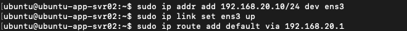

* **Objective:** Assign static Layer 3 networking to the Application host (`ubuntu-app-svr02`) within VLAN 20 and establish default routing back to the VyOS core gateway.
* **Key Implementation Details:**
  * **Static IP Provisioning:** Configured `192.168.20.10/24` on interface `ens3` to bind the server to the Application VLAN segment.
  * **Interface Activation:** Brought the network interface operational state to **Up** (`sudo ip link set ens3 up`).
  * **Default Route Forwarding:** Directed all off-subnet traffic to the VyOS core router gateway interface (`192.168.20.1`).

---

## Inter-VLAN Connectivity & Path MTU Validation

### Management Server Reachability & PMTUD Test

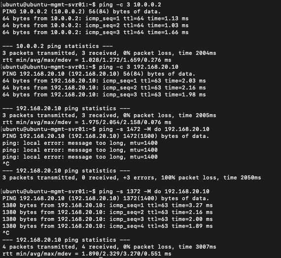

* **Objective:** Verify end-to-end ICMP reachability from the Management server (`192.168.10.10`) to the core router backbone and Application host, and validate Path MTU Discovery (PMTUD) behavior across constrained links.
* **Key Implementation Details:**
  * **Core Backbone Reachability:** Successfully pinged the VyOS transit interface (`10.0.0.2`) with **0% packet loss**.
  * **Inter-VLAN Reachability:** Verified routing to the Application Server (`192.168.20.10`) across subnets with **0% packet loss** (`TTL=63` indicating a single L3 router hop).
  * **PMTUD Boundary Enforcement:** Executed a DF (Don't Fragment) ping with 1472 payload bytes (`1500` total packet size). The kernel rejected the packet locally (`message too long, mtu=1400`) due to the target path constraint.
  * **MTU Size Validation:** Re-sent ICMP probe with a 1372 payload byte payload (`1400` total packet size), confirming successful transmission without fragmentation.

### Application Server Reachability Validation

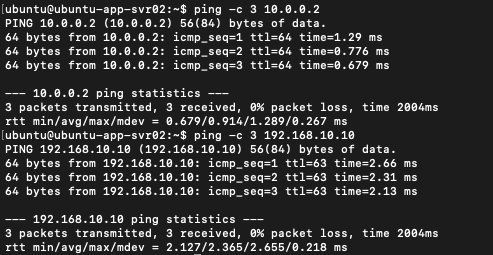

* **Objective:** Validate outbound layer 3 reachability from the Application server (`192.168.20.10`) to the VyOS core router transit interface and cross-subnet to the Management server.
* **Key Implementation Details:**
  * **Transit Backbone Verification:** Successfully reached the VyOS transit interface (`10.0.0.2`) with **0% packet loss** and sub-millisecond average latency.
  * **Reverse Inter-VLAN Verification:** Confirmed bi-directional routing by pinging the Management Server (`192.168.10.10`) with **0% packet loss** (`TTL=63` confirming standard single-hop core routing traversal).

---

## Perimeter Firewall & Edge Gateway Setup

### pfSense Interface Addressing & Management Console

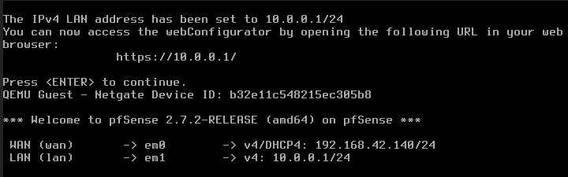

* **Objective:** Initialize the pfSense 2.7.2 perimeter firewall, binding interface roles to WAN/LAN networks and enabling management access.
* **Key Implementation Details:**
  * **Perimeter Gateway Configuration:** Provisioned the LAN interface (`em1`) with static IP `10.0.0.1/24` to act as the primary next-hop gateway for core router transit.
  * **WAN Interface Provisioning:** Confirmed the WAN interface (`em0`) obtained upstream DHCP lease `192.168.42.140/24` for outbound internet reachability.
  * **Web Management Access:** Established HTTPS webConfigurator management access via `https://10.0.0.1/` over the internal transit network.

### Transit Link Connectivity Verification

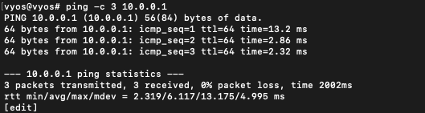

* **Objective:** Validate point-to-point layer 3 reachability across the transit link connecting the VyOS core router to the pfSense edge firewall gateway.
* **Key Implementation Details:**
  * **Core-to-Edge Transit Test:** Transmitted ICMP probes from VyOS (`10.0.0.2`) to the pfSense LAN interface (`10.0.0.1`).
  * **Link Performance:** Confirmed active bidirectional connectivity with **0% packet loss** across 3 transmitted packets (`TTL=64` indicating direct local-segment adjacency).

### Downstream Static Route Propagation on pfSense

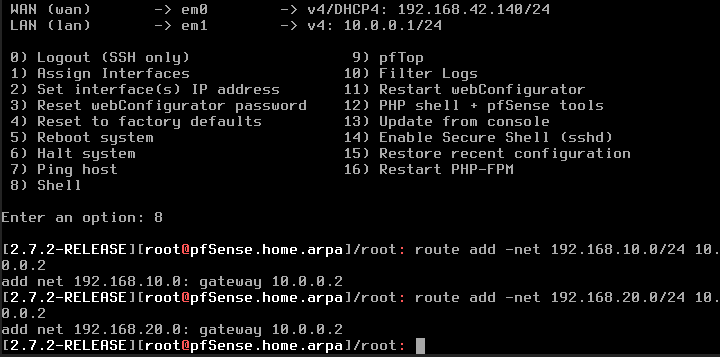

* **Objective:** Provision downstream static routes on the pfSense firewall to direct return traffic for internal subnets back through the VyOS core router.
* **Key Implementation Details:**
  * **Management Subnet Route:** Added static route entry for `192.168.10.0/24` pointing to next-hop gateway `10.0.0.2` (VyOS `eth0`).
  * **Application Subnet Route:** Added static route entry for `192.168.20.0/24` pointing to next-hop gateway `10.0.0.2` (VyOS `eth0`).
  * **Routing Table Symmetry:** Ensured the edge firewall possesses explicit path knowledge for internal VLANs, enabling stateful return flow processing for outbound subnets.

---

## Stateful Firewall & Traffic Isolation

### VyOS Stateful Firewall & SSH Access Policy

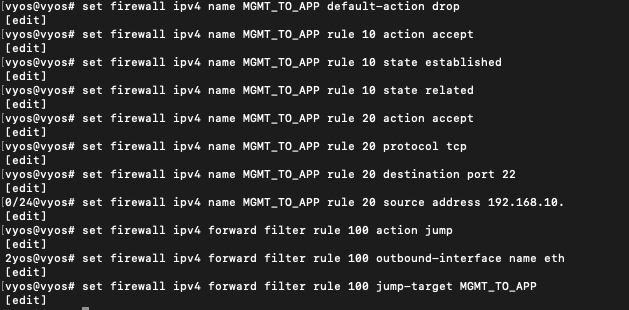

* **Objective:** Construct a stateful IPv4 firewall ruleset (`MGMT_TO_APP`) on the core VyOS router to restrict inter-VLAN access, permitting only explicit SSH administrative sessions from Management to Application subnets.
* **Key Implementation Details:**
  * **Default Security Stance:** Established an explicit `default-action drop` policy on the `MGMT_TO_APP` ruleset to enforce zero-trust traffic boundaries.
  * **Stateful Inspection (Rule 10):** Configured rule to permit existing `established` and `related` connection flows, allowing bidirectional data transfer for approved sessions.
  * **Explicit Management SSH Access (Rule 20):** Allowed inbound TCP port 22 (SSH) traffic strictly originating from the Management subnet (`192.168.10.0/24`).
  * **Forward Filter Binding (Rule 100):** Applied the custom ruleset as a forward filter jump-target for egress traffic directed out interface `eth2.20` toward the Application VLAN.

### Firewall Configuration Verification

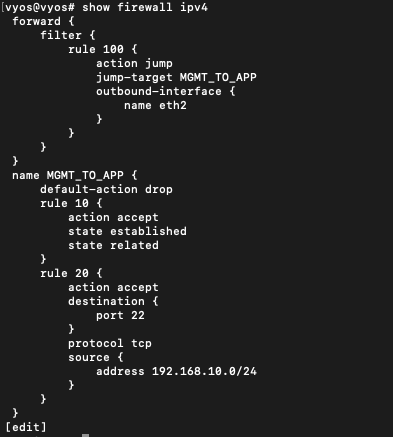

* **Objective:** Validate the active VyOS IPv4 firewall configuration hierarchy, confirming forward filter attachment points and rule conditions prior to commit.
* **Key Implementation Details:**
  * **Forward Filter Mapping:** Confirmed `forward filter rule 100` targets all outbound traffic on `eth2` and jumps to the `MGMT_TO_APP` inspection chain.
  * **Chain Integrity:** Verified `default-action drop` policy is active alongside stateful packet inspection (`established`, `related`) in `rule 10`.
  * **Access Scope:** Re-verified `rule 20` limits permitted connections exclusively to TCP port 22 originating from `192.168.10.0/24`.

### Policy Enforcement & Packet Capture Analysis

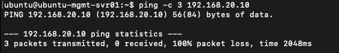

* **Objective:** Validate that non-permitted ICMP traffic originating from the Management VLAN is actively blocked from traversing to the Application VLAN by the VyOS forward filter.
* **Key Implementation Details:**
  * **Traffic Drop Verification:** Attempted ICMP echo requests from Management (`192.168.10.10`) to Application (`192.168.20.10`), resulting in **100% packet loss**.
  * **Default Stance Enforcement:** Confirmed the `MGMT_TO_APP` policy's default-drop behavior successfully suppresses non-explicitly allowed protocols (ICMP/8).

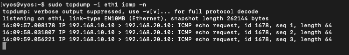

* **Objective:** Capture packet ingress on the core router to confirm that blocked ICMP traffic reaches the ingress interface before being dropped by forward filters.
* **Key Implementation Details:**
  * **Ingress Packet Inspection:** Executed `tcpdump -i eth1 icmp -n` on VyOS, observing active `ICMP echo request` frames arriving from `192.168.10.10`.
  * **Filter Verification:** Confirmed packets ingress via `eth1` but are prevented from forwarding out egress interface `eth2` due to the applied ACL policy.

---

## Deep-Dive Protocol & MTU Header Analysis

### Layer 3 Data Link Framing & PMTUD Boundary Verification

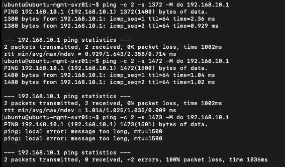

* **Objective:** Demonstrate precise Maximum Transmission Unit (MTU) boundaries on the Management interface (`1500` MTU) using Don't Fragment (DF) ICMP probes.
* **Key Implementation Details:**
  * **1400-Byte Frame Test:** Transmitted 1372-byte payload + 28-byte IP/ICMP headers (`1400` total bytes), receiving **0% packet loss**.
  * **1500-Byte Frame Test:** Transmitted 1472-byte payload + 28-byte IP/ICMP headers (`1500` total bytes), matching max MTU capacity with **0% packet loss**.
  * **Frame Exceed Boundary:** Attempted 1473-byte payload (`1501` total bytes with headers). The kernel dropped the frame locally (`message too long, mtu=1500`) to prevent unpermitted fragmentation.

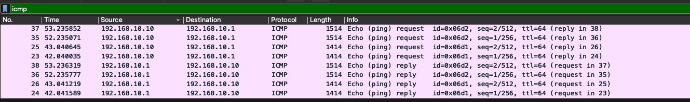

* **Objective:** Capture and analyze packet-length deltas at the wire level between standard 1400 MTU and 1500 MTU frame transfers.
* **Key Implementation Details:**
  * **Frame Length Breakdown:** Captured total Ethernet frame lengths including the 14-byte L2 header:
    * **Frames 23-26:** 1372-byte payload = `1414` bytes total wire length.
    * **Frames 35-38:** 1472-byte payload = `1514` bytes total wire length.
  * **Bi-Directional Traversal:** Verified symmetric Echo Request/Reply pairing between `192.168.10.10` and gateway `192.168.10.1`.

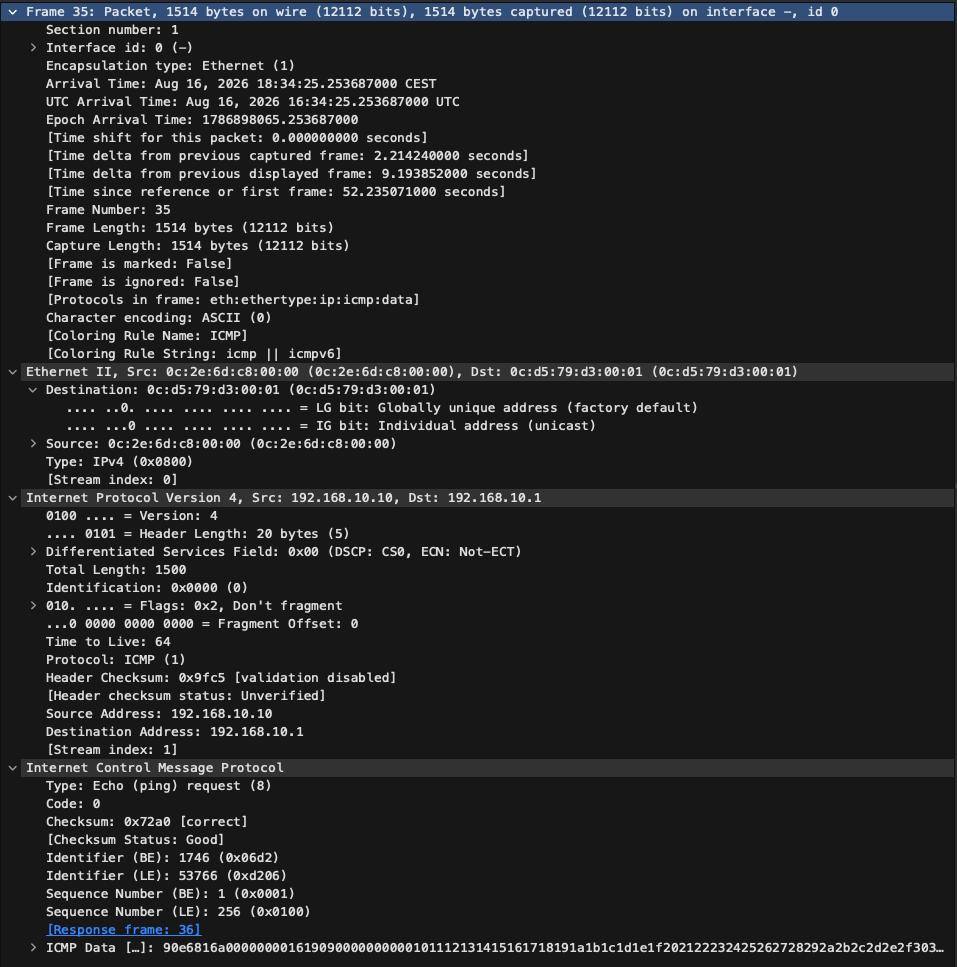

* **Objective:** Inspect packet headers in Wireshark to verify IP flags, total length calculations, and encapsulation overhead.
* **Key Implementation Details:**
  * **L2 Framing Overhead:** Observed total length of `1514` bytes on wire (14-byte Ethernet Header + 1500-byte IPv4 packet).
  * **IPv4 Header Inspection:** Verified IP Header Length of **20 bytes** (`Header Length: 20 bytes (5)`), Total Length of **1500 bytes**, and active **Don't Fragment (DF)** bit (`Flags: 0x2, Don't fragment`).
  * **ICMP Payload Breakdown:** Confirmed ICMP header of **8 bytes** (`Type 8 Echo Request`), demonstrating the exact header arithmetic: $1472 \text{ payload} + 8 \text{ ICMP} + 20 \text{ IP} = 1500 \text{ IP Total Length}$.

---

## Key Takeaways & Engineering Insights

* **Symmetric Routing & Path Knowledge:** Explicit downstream routes on edge firewalls are essential in multi-tier topologies. Without back-routes to internal subnets (`192.168.10.0/24` and `192.168.20.0/24`), return traffic is dropped at the perimeter, causing asymmetric routing failures.
* **Stateful Filtering Efficiency:** Implementing stateful tracking (`established`, `related`) significantly reduces ACL rule complexity. Bypassing state tracking would require manual reverse-path rules for every permitted outbound flow.
* **PMTUD Overhead Mechanics:** Constrained MTU boundaries impact data transfer efficiency. Wire-level captures confirm that a 28-byte overhead (20-byte IP header + 8-byte ICMP header) must always be accounted for when tuning maximum transmission units to prevent fragmentation drops or ICMP "Destination Unreachable / Fragmentation Needed" signaling errors.
