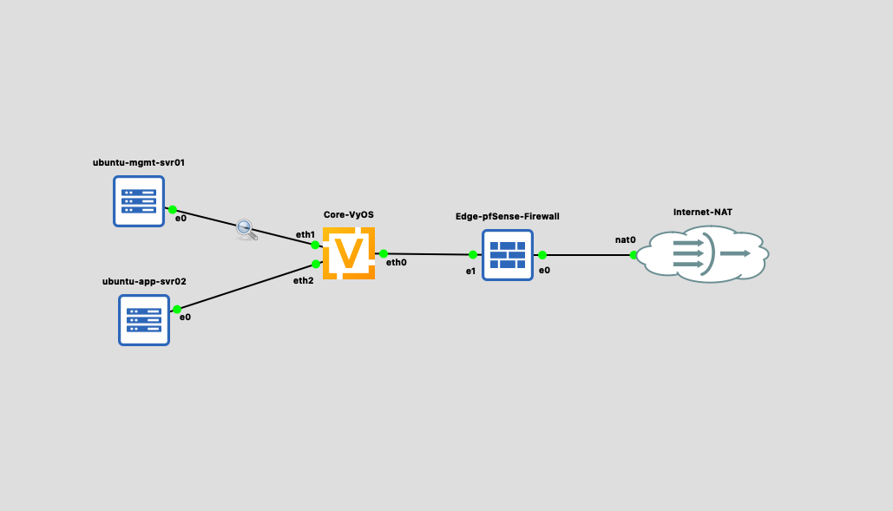
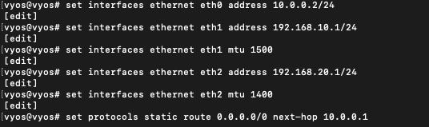
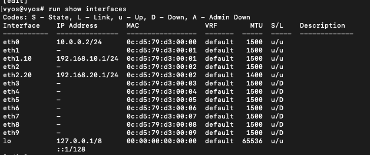

# Lab 1: Enterprise Edge Isolation & Firewall Enforcement

## Overview
This lab implements an enterprise edge network architecture utilizing a **pfSense Edge Firewall**, a **VyOS Core Router**, and dual isolated **Ubuntu Linux subnets**. The project focuses on core networking fundamentals including inter-VLAN routing, Path MTU Discovery (PMTUD) troubleshooting, static route propagation, and protocol header analysis.

## Network Architecture & Topology

* **Objective:** Design a secure, multi-zone enterprise network that isolates administrative management systems from core application workloads while maintaining monitored internet connectivity.
* **Architecture Breakdown:**
  * **Edge Defense Layer:** A pfSense perimeter firewall managing external connectivity (WAN) and performing Network Address Translation (NAT) to protect internal hosts.
  * **Core Routing Layer:** A VyOS core router operating at Layer 3 to handle inter-VLAN routing and enforce traffic boundaries between distinct network segments.
  * **Isolated Internal Subnets:**
    * **Management Zone (VLAN 10):** Dedicated network segment (`192.168.10.0/24`) for administrative operations.
    * **Application Zone (VLAN 20):** Isolated network segment (`192.168.20.0/24`) for application workloads, configured with a constrained **1400 MTU** to analyze Path MTU Discovery (PMTUD) behavior.

## Core Routing & Gateway Configuration

* **Objective:** Configure the VyOS core router with Layer 3 IP gateways for all internal subnets, set non-standard MTU limits for traffic control testing, and establish a default route toward the edge security perimeter.
* **Key Implementation Details:**
  * **Transit Interface:** Assigned `10.0.0.2/24` to `eth0` to establish the backbone interconnect with the pfSense firewall.
  * **Management Gateway:** Provisioned `192.168.10.1/24` on `eth1` with standard Ethernet framing (**MTU 1500**).
  * **Application Gateway & MTU Tuning:** Provisioned `192.168.20.1/24` on `eth2` and clamped the interface to **MTU 1400** to enable downstream Path MTU Discovery (PMTUD) analysis.
  * **Default Outbound Route:** Configured static default route (`0.0.0.0/0`) directing all external traffic to next-hop gateway `10.0.0.1` (pfSense LAN interface).

### Core Interface Verification & VLAN Binding

* **Objective:** Verify operational state (`u/u`), IP address bindings, and MTU values across all active core router interfaces using the CLI operational output.
* **Key Implementation Details:**
  * **Interface Operational State:** Confirmed `u/u` (Admin Up / Link Up) status for active data paths (`eth0`, `eth1.10`, `eth2.20`, and `lo`).
  * **VLAN Tagging & Subinterface Structure:**
    * **`eth1.10`:** Subinterface bound to Management VLAN 10 (`192.168.10.1/24`) operating at standard **1500 MTU**.
    * **`eth2.20`:** Subinterface bound to Application VLAN 20 (`192.168.20.1/24`) explicitly configured to **1400 MTU**.
  * **Transit Interface:** Confirmed `eth0` is operational with transit IP `10.0.0.2/24` and standard **1500 MTU**.
