Lab 2: Enterprise Multi-Tier Architecture & DMZ Isolation
Overview
This lab expands our baseline enterprise architecture into a production-grade 3-tier network topology. By introducing a Demilitarized Zone (DMZ) alongside an Internal LAN and a dedicated Management VLAN, this project enforces strict ingress/egress filtering rules, isolates public-facing web services, and sets up a controlled target environment for multi-stage penetration testing and pivoting exercises.

Core Security Objectives & ACL Matrix
To enforce zero-trust isolation on the VyOS core router, we define four strict firewall traffic flows:
DMZ Isolation Rule: Hosts in the DMZ (172.16.30.0/24) MUST NOT initiate any connection into the Internal LAN (192.168.20.0/24) or Management Zone (192.168.10.0/24).
DMZ Service Access: Management and Internal LAN hosts can access HTTP/HTTPS (TCP 80/443) and SSH (TCP 22) on DMZ hosts.
Stateful Ingress Processing: Return traffic from the DMZ is permitted only if the connection was initiated by internal hosts (established, related).
Edge Gateway Routing: Downstream static routes on pfSense must be updated to route return traffic for 172.16.30.0/24 back to next-hop 10.0.0.2.

----

# Lab 2: Enterprise Multi-Tier Architecture & DMZ Isolation

## Overview
This lab expands our enterprise network architecture into a production-grade 3-tier topology within GNS3, introducing a Demilitarized Zone (DMZ) alongside the internal LAN and Management subnets. By deploying a dedicated DMZ router (`DMZ-VyOS`) connected directly to the `Edge-pfSense-Firewall`, this project enforces strict perimeter isolation, configures stateful ingress/egress filtering rules, and establishes structured routing paths to securely host public-facing services while protecting internal workloads.

---

## Network Architecture & Topology

* **Objective:** Design and validate a secure 3-tier enterprise architecture that completely isolates public-facing DMZ servers from internal administrative and application segments.
* **Architecture Breakdown:**
  * **Edge Security Perimeter:** A pfSense firewall managing WAN access (Internet-NAT), internal transit (`10.0.0.1/24`), DMZ transit (`10.0.1.1/24`), and out-of-band management connectivity via a dedicated Windows Admin host (`192.168.100.0/24`).
  * **Core Routing Layer:** A `Core-VyOS` router handling inter-VLAN routing for internal subnets (`192.168.10.0/24` Management and `192.168.20.0/24` Application).
  * **DMZ Routing Layer:** A dedicated `DMZ-VyOS` router servicing the DMZ segment (`172.16.30.0/24`) and enforcing strict ingress/egress firewall boundary policies.
  * **Isolated Workloads:**
    * **Management Zone:** `ubuntu-mgmt-svr01` (`192.168.10.10/24`).
    * **Application Zone:** `ubuntu-app-svr02` (`192.168.20.10/24`).
    * **DMZ Public Host:** `DMZ-Public-Server` (`172.16.30.10/24`).

---
## DMZ Routing & Boundary Firewall Enforcement

### DMZ Router Interface & Gateway Provisioning

* **Objective:** Assign Layer 3 addressing across transit and local DMZ interfaces on `DMZ-VyOS` and configure default outbound routing toward the pfSense edge firewall.
* **Key Implementation Details:**
  * **Transit Interface (`eth0`):** Assigned IP `10.0.1.2/24` with description `TRANSIT-TO-PFSENSE-E3` to establish the upstream interconnection.
  * **DMZ Host Interface (`eth1`):** Assigned IP `172.16.30.1/24` with description `DMZ-HOST-SEGMENT` to act as the default gateway for public-facing servers.
  * **Default Gateway:** Applied static default route (`0.0.0.0/0`) pointing to next-hop `10.0.1.1` (pfSense DMZ interface `e3`).

---

### DMZ Router Interface State Verification

* **Objective:** Verify operational link status (`u/u`), IP address bindings, and descriptions across all physical and logical interfaces on `DMZ-VyOS`.
* **Key Implementation Details:**
  * **Transit Link (`eth0`):** Confirmed active state (`u/u`) with `10.0.1.2/24` bound and standard **1500 MTU**.
  * **DMZ Host Link (`eth1`):** Confirmed active state (`u/u`) with `172.16.30.1/24` bound and standard **1500 MTU**.
  * **Inactive Interfaces:** Verified interfaces `eth2` through `eth9` remain unconfigured in link-down state (`u/D`).

---

### Boundary Firewall Ruleset Construction & Forward Filter Binding

* **Objective:** Construct a stateful, zero-trust boundary firewall policy (`DMZ_ISOLATION`) on `DMZ-VyOS` to guarantee that compromised DMZ hosts cannot pivot into internal subnets, while allowing internal management access and outbound internet egress.
* **Key Implementation Details & Rationale:**
  * **Stateful Flow Preservation (Rule 10):** Permitted connection states `established` and `related`. This allows inbound management sessions (such as SSH from VLAN 10) to receive return packets without requiring dangerous, open back-door rules from the DMZ back toward internal networks.
  * **Strict Internal Subnet Isolation (Rules 20 & 30):** Configured explicit `action drop` rules targeting destination subnets `192.168.10.0/24` (Management) and `192.168.20.0/24` (Application). Even if an attacker gains root-level remote code execution on the public DMZ server, any packet initiated toward internal enterprise networks is dropped immediately at the L3 boundary interface.
  * **Default Action & Internet Egress Rationale:** Set `default-action accept` on the `DMZ_ISOLATION` chain. Because Rules 20 and 30 explicitly block internal destinations, all remaining unmatched traffic (e.g., outbound internet update traffic destined for `0.0.0.0/0`) is permitted to flow out through pfSense WAN NAT.
  * **Forward Filter Mapping (`eth1` Ingress):** Configured `forward filter rule 10` to bind directly to `inbound-interface eth1` with `action jump` targeting `DMZ_ISOLATION`. Filtering packets at the exact point of ingress prevents unauthorized frames from ever reaching the VyOS routing engine or transit links.
 
---
### Edge Gateway & Transit Interface Setup (pfSense via TigerVNC Console)

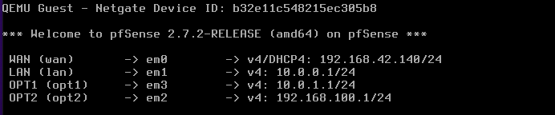

* **Objective:** Establish physical-to-logical interface bindings on the pfSense firewall and assign static transit addressing to tie the upstream network segments together.
* **Why We Configured It This Way:**
  * **Interface Allocation Strategy:** Assigned `em0` to WAN (`192.168.42.140/24 via DHCP`) for upstream connectivity, `em1` to LAN (`10.0.0.1/24`), `em3` as **OPT1** (`10.0.1.1/24`) for the DMZ transit link, and `em2` as **OPT2** (`192.168.100.1/24`) for out-of-band management access.
  * **Isolating Transit Traffic:** Mapping **OPT1 (`em3`)** to the `10.0.1.0/24` subnet creates a dedicated transit link between pfSense and the `DMZ-VyOS` boundary router. Keeping this transit pipe strictly separate from internal LAN traffic ensures all DMZ egress traffic can be cleanly routed and inspected without bleeding into internal client segments.

---

### End-to-End Transit Connectivity Verification

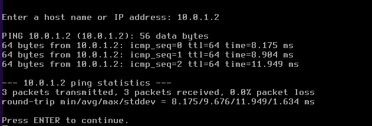

* **Objective:** Verify basic Layer 3 reachability across the dedicated transit link from pfSense (`10.0.1.1`) to the `DMZ-VyOS` router interface (`10.0.1.2`).
* **Why We Verified It Here:**
  * **Validating the Physical & Logical Path:** Executing an ICMP echo request directly from the pfSense console menu before jumping into web management proves that interface assignment, IP binding, and physical layer links are fully operational.

  
  * **Diagnostic Baseline:** Receiving a 0% packet loss response (`3 packets transmitted, 3 received`, avg ~9.6ms) gives us immediate confirmation that the underlying virtual switch fabric is functioning properly. This guarantees that any connection failures we encounter down the road stem from firewall policy definitions rather than basic routing or cable misconfigurations.

---

### Upstream Routing & Next-Hop Gateway Definitions (pfSense Web GUI)

#### System Routing Table & Default Gateway Audit

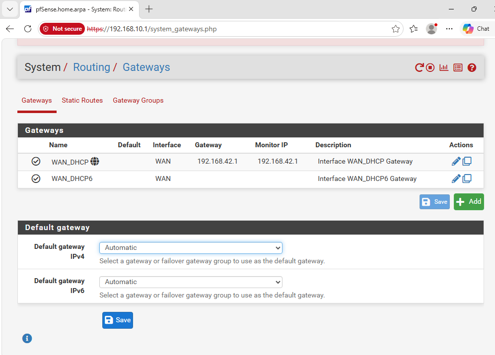

* **Objective:** Review the initial edge gateway configuration under `System > Routing > Gateways` before declaring internal downstream routers.
* **Why We Checked This First:**
  * **Establishing Base Internet Egress:** Before pointing pfSense toward internal downstream networks, we need to verify that upstream internet connectivity is active. The interface shows `WAN_DHCP` pointing to `192.168.42.1` with active monitoring enabled.
  * **Preventing Asymmetric Routing Loops:** Leaving the default gateway on `Automatic` ensures internet-bound traffic defaults to the upstream WAN interface, rather than accidentally trying to send public traffic back toward internal gateways we are about to add.

---

#### DMZ Transit Gateway Definition (`DMZ_GW`)

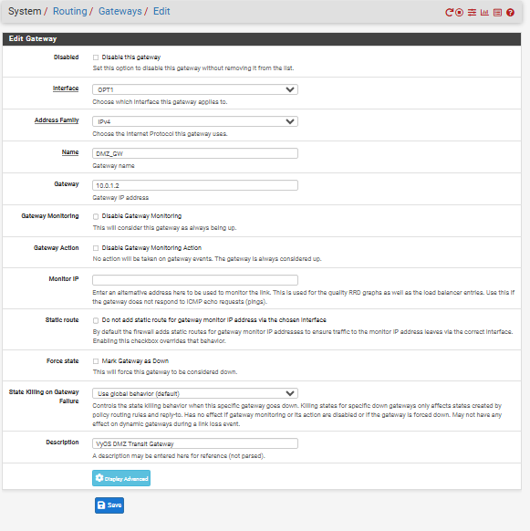

* **Objective:** Define `DMZ_GW` pointing to `10.0.1.2` on the `OPT1` interface as the designated next-hop for all DMZ-bound traffic.
* **Why We Configured It This Way:**
  * **Decoupling Interface IP from Route Target:** While pfSense sits on `10.0.1.1/24` on `OPT1`, it needs an explicit gateway object to forward packets toward the isolated DMZ network (`172.16.30.0/24`) sitting behind `DMZ-VyOS` (`10.0.1.2`).
  * **Targeted Health Monitoring:** By default, pfSense uses the gateway IP (`10.0.1.2`) for RRD quality tracking and ICMP health checks. This gives us real-time visibility into transit link latency and packet loss right from the pfSense dashboard.

---

#### Core Router Gateway Definition (`CORE_VYOS_GW`)

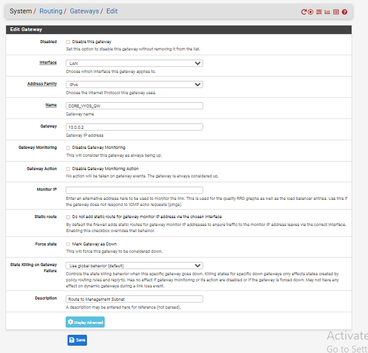

* **Objective:** Define `CORE_VYOS_GW` pointing to `10.0.0.2` on the `LAN` interface to handle downstream routing for internal enterprise subnets.
* **Why We Configured It This Way:**
  * **Bridging Edge to Core:** The core enterprise router (`10.0.0.2`) manages internal segments like Management (`192.168.10.0/24`). Defining this gateway gives pfSense an explicit next-hop address for returning traffic destined for internal users and infrastructure.
  * **Architectural Layering:** Separating `CORE_VYOS_GW` (LAN interface) from `DMZ_GW` (OPT1 interface) forces pfSense to keep internal corporate traffic and untrusted DMZ traffic on completely independent physical/logical paths at the firewall boundary.

---
#### Gateway Table Verification & Health Audit

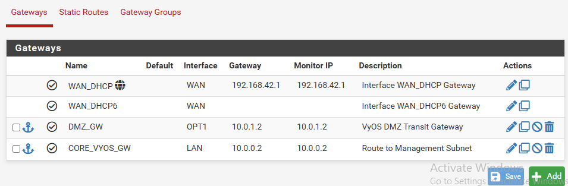

* **Objective:** Validate that all internal and external next-hop gateways are active, correctly bound to their respective interfaces, and passing health checks.
* **Why We Verified It Here:**
  * **Status & Monitoring Confirmation:** Seeing the green checkmark icons next to `DMZ_GW` (`10.0.1.2` on `OPT1`) and `CORE_VYOS_GW` (`10.0.0.2` on `LAN`) confirms that pfSense is successfully probing both VyOS routers via ICMP.
  * **Pre-requisite for Static Routes:** Gateways in pfSense act as targets for static routes. Confirming that both gateways are active and bound to the right interfaces here guarantees that our static routing table entries in the next step will actually activate rather than failover or drop packets.

---

## Downstream Routing & Egress NAT Configuration (pfSense Web GUI)

### DMZ Subnet Static Route Injection

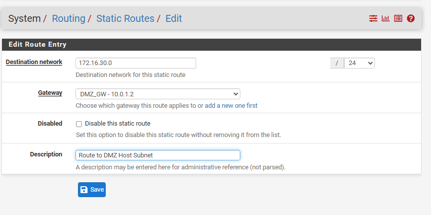

* **Objective:** Map a static route sending `172.16.30.0/24` traffic directly to `DMZ_GW` (`10.0.1.2`).
* **Why We Configured It This Way:**
  * **Resolving Non-Local Subnet Reachability:** pfSense only has direct interface visibility to `10.0.1.0/24`. Explicit static routing guarantees packets destined for `172.16.30.0/24` are handed directly to `DMZ-VyOS` rather than dropped or routed out to the WAN interface.
  * **Delegated Policy Enforcement:** Forwarding the entire `/24` block to `DMZ-VyOS` delegates host-level filtering decisions to the dedicated boundary firewall.

---

### Internal Enterprise Subnet Static Routes

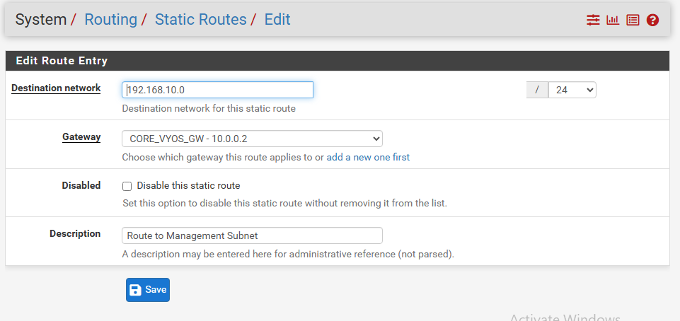

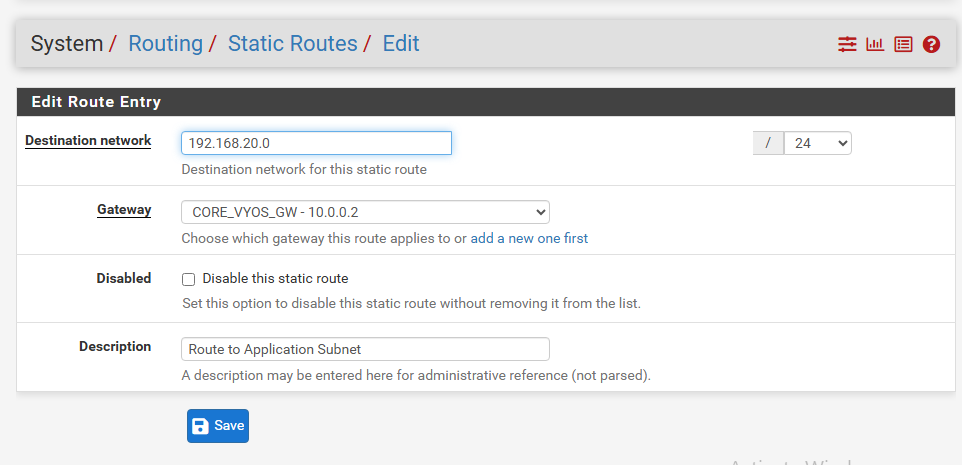

* **Objective:** Create static routes for internal zones—Management (`192.168.10.0/24`) and Application (`192.168.20.0/24`)—pointing to `CORE_VYOS_GW` (`10.0.0.2`).
* **Why We Configured It This Way:**
  * **Eliminating Asymmetric Paths:** Internal corporate endpoints reside behind `10.0.0.2`. Explicit static routes ensure return traffic from internet sessions or edge services travels back through `CORE_VYOS_GW` without path asymmetry.
  * **Traffic Segmentation:** Isolating corporate routes from DMZ paths ensures enterprise internal traffic never leaks into the transit link reserved for DMZ workloads.

---

### Ingress Firewall Policy for DMZ Transit Interface

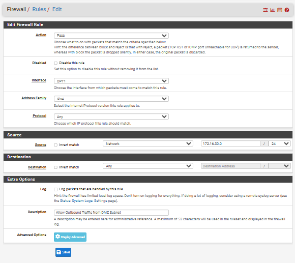

* **Objective:** Configure an ingress pass rule on interface `OPT1` permitting source traffic from `172.16.30.0/24` destined for `Any` target.
* **Why We Configured It This Way:**
  * **Overriding Default Ingress Block:** pfSense enforces a default-deny policy on optional interfaces (`OPT1`). Without an explicit pass rule, packets entering `OPT1` from `172.16.30.0/24` are silently dropped.
  * **Edge Egress Facilitation:** Allowing `172.16.30.0/24` on `OPT1` enables DMZ traffic to reach the Outbound NAT engine and exit to public networks, while `DMZ-VyOS` retains responsibility for strict lateral control between internal segments.

---

### Advanced Outbound NAT for DMZ Egress

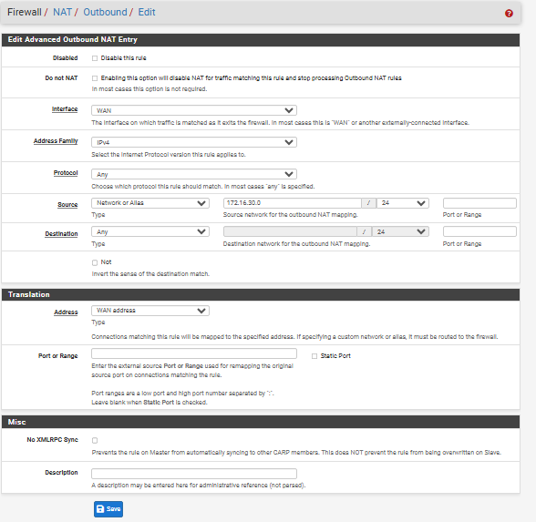

* **Objective:** Implement an Advanced Outbound NAT rule translating source addresses from `172.16.30.0/24` exiting `WAN` into the primary `WAN address`.
* **Why We Configured It This Way:**
  * **Handling RFC 1918 Address Translation:** Upstream ISPs drop unroutable private addresses (`172.16.30.0/24`). Port Address Translation (PAT) allows DMZ hosts to access internet resources (such as package repositories and patch servers) using the public WAN IP.
  * **Topology Masking:** Masquerading internal IP structures prevents external entities from mapping internal DMZ addressing layouts during outbound connections.

---

## DMZ Server Provisioning & End-to-End Egress Verification

### DMZ Server Network & Hostname Initialization

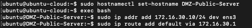

* **Objective:** Assign an explicit hostname (`DMZ-Public-Server`), assign a static IP address (`172.16.30.10/24`) to interface `ens3`, and establish a default route via gateway `172.16.30.1`.
* **Why We Configured It This Way:**
  * **Hostname Standardization:** Updating the hostname from generic `ubuntu-cloud` to `DMZ-Public-Server` ensures clear identification in system loggers, firewall state tables, and network monitoring dashboards.
  * **Layer 3 Subnet Binding:** Binding static IP `172.16.30.10/24` directly to interface `ens3` places the server into the isolated DMZ host network segment governed by `DMZ-VyOS`.
  * **Default Egress Delegation:** Setting `172.16.30.1` (`DMZ-VyOS` interface `eth1`) as the default gateway ensures all non-local outbound connections are forwarded directly to the DMZ boundary router for policy inspection.

---

### End-to-End DMZ Reachability & Egress Routing Audit

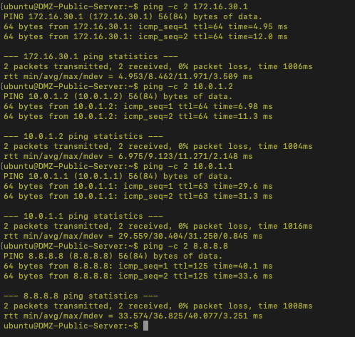

* **Objective:** Execute sequential ICMP connectivity tests from `DMZ-Public-Server` across every hop in the network path—from local gateway to edge firewall to external public internet (`8.8.8.8`).
* **Why We Verified It Here:**
  * **Local Gateway Verification (`172.16.30.1`):** Achieved 0% packet loss (average RTT ~8.4 ms), confirming Layer 2 switch connectivity and functional Layer 3 interface binding on `DMZ-VyOS`.
  * **Transit Router Gateway Verification (`10.0.1.2`):** Achieved 0% packet loss (average RTT ~9.1 ms), proving that `DMZ-VyOS` correctly routes packets internally across its interfaces (`eth1` to `eth0`).
  * **Edge Firewall Verification (`10.0.1.1`):** Achieved 0% packet loss (average RTT ~30.4 ms with TTL drop to 63), confirming that the pfSense `OPT1` ingress rule successfully permits source traffic from `172.16.30.0/24`.
  * **Public Internet Egress Verification (`8.8.8.8`):** Achieved 0% packet loss (average RTT ~36.8 ms), conclusively proving that pfSense’s Outbound NAT rule translates `172.16.30.10` to the WAN address and completes full-path external routing.

---

## Security Policy Enforcement & Isolation Verification

### DMZ Outbound Isolation Enforcement (Ping Timeout Tests)

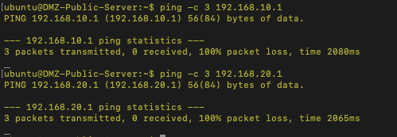

* **Objective:** Test policy enforcement on `DMZ-Public-Server` by initiating ICMP echo requests toward internal enterprise networks: Management (`192.168.10.1`) and Application (`192.168.20.1`).
* **Why We Verified It Here:**
  * **Zero-Trust Boundary Validation:** Both ping attempts resulted in `100% packet loss` (`3 packets transmitted, 0 received`). This confirms that DMZ hosts cannot initiate lateral movement into internal corporate zones.
  * **Validating Drop Actions:** This test proves that rules 20 and 30 on the `DMZ_ISOLATION` firewall chain are actively evaluating traffic coming in on `eth1` and dropping packets directed toward private enterprise subnets.

---

### Packet Capture Inspection on Boundary Router (`tcpdump`)

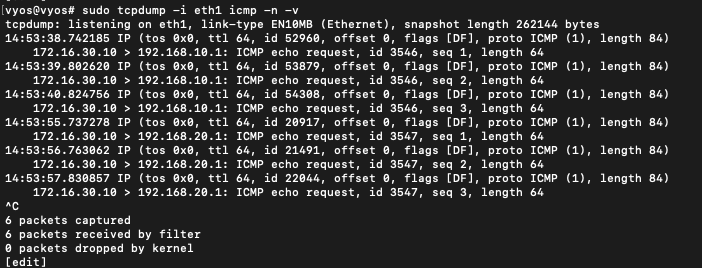

* **Objective:** Execute `sudo tcpdump -i eth1 icmp -n -v` on `DMZ-VyOS` to monitor real-time ICMP traffic arriving from the DMZ server.
* **Why We Verified It Here:**
  * **Ingress Ingestion Evidence:** The packet capture shows `172.16.30.10` sending ICMP echo requests targeting `192.168.10.1` and `192.168.20.1` on `eth1`.
  * **Policy Enforcement Proof:** While `tcpdump` captures the packets arriving at `eth1`, no corresponding egress echo requests or reply packets exit toward the internal networks or pfSense. This confirms that the firewall engine intercepts and silently drops these frames before L3 forwarding occurs.

---

### Inbound Management Access & Port Audit (`nc` / SSH)

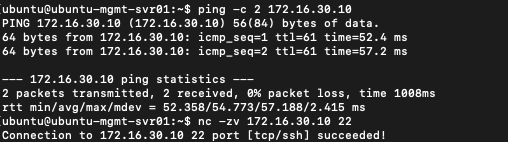

* **Objective:** Initiate ICMP reachability and TCP port checks (`nc -zv`) from an internal management host (`ubuntu-mgmt-svr01`) targeting `DMZ-Public-Server` (`172.16.30.10`) on port 22 (SSH).
* **Why We Verified It Here:**
  * **Stateful Flow Inspection Validation:** `ping` succeeds with 0% packet loss, and `nc -zv 172.16.30.10 22` returns `Connection to 172.16.30.10 22 port [tcp/ssh] succeeded!`.
  * **Stateful Firewall Symmetry:** This validates rule 10 (`state established, related`) on the DMZ firewall policy. Inbound management sessions initiated from trusted internal networks are allowed in, and the server's return traffic is permitted out without exposing internal networks to uninitiated DMZ traffic.
