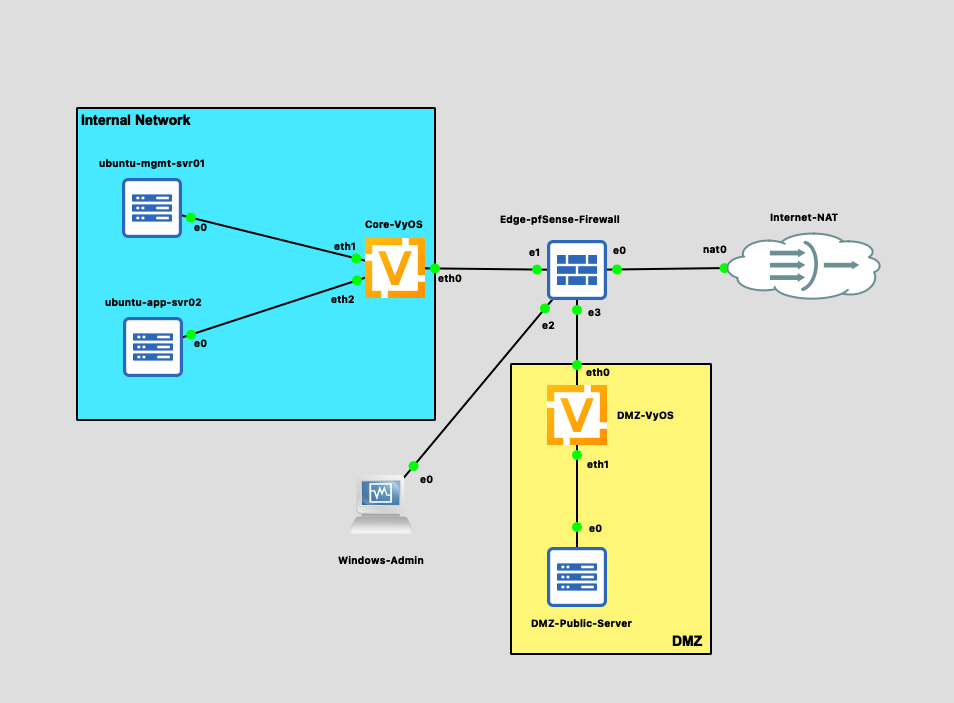
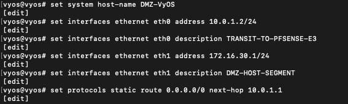
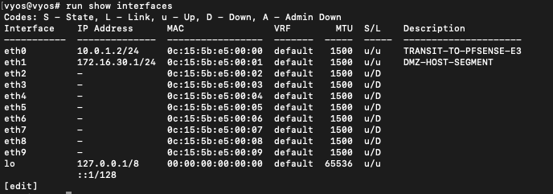
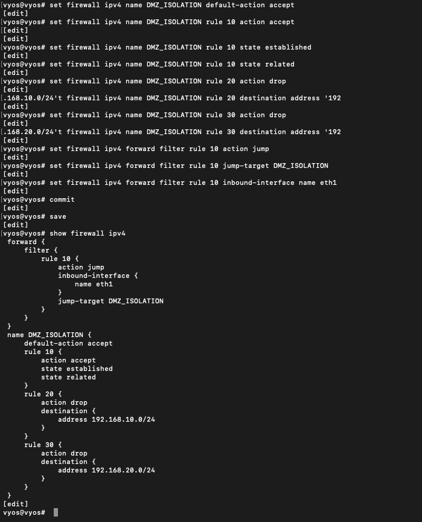

Lab 2: Enterprise Multi-Tier Architecture & DMZ Isolation
Overview
This lab expands our baseline enterprise architecture into a production-grade 3-tier network topology. By introducing a Demilitarized Zone (DMZ) alongside an Internal LAN and a dedicated Management VLAN, this project enforces strict ingress/egress filtering rules, isolates public-facing web services, and sets up a controlled target environment for multi-stage penetration testing and pivoting exercises.

Core Security Objectives & ACL Matrix
To enforce zero-trust isolation on the VyOS core router, we define four strict firewall traffic flows:
DMZ Isolation Rule: Hosts in the DMZ (172.16.30.0/24) MUST NOT initiate any connection into the Internal LAN (192.168.20.0/24) or Management Zone (192.168.10.0/24).
DMZ Service Access: Management and Internal LAN hosts can access HTTP/HTTPS (TCP 80/443) and SSH (TCP 22) on DMZ hosts.
Stateful Ingress Processing: Return traffic from the DMZ is permitted only if the connection was initiated by internal hosts (established, related).
Edge Gateway Routing: Downstream static routes on pfSense must be updated to route return traffic for 172.16.30.0/24 back to next-hop 10.0.0.2.

----

# Lab 2: Enterprise Multi-Tier Architecture & DMZ Isolation

## Overview
This lab expands our enterprise network architecture into a production-grade 3-tier topology within GNS3, introducing a Demilitarized Zone (DMZ) alongside the internal LAN and Management subnets. By deploying a dedicated DMZ router (`DMZ-VyOS`) connected directly to the `Edge-pfSense-Firewall`, this project enforces strict perimeter isolation, configures stateful ingress/egress filtering rules, and establishes structured routing paths to securely host public-facing services while protecting internal workloads.

---

## Network Architecture & Topology

* **Objective:** Design and validate a secure 3-tier enterprise architecture that completely isolates public-facing DMZ servers from internal administrative and application segments.
* **Architecture Breakdown:**
  * **Edge Security Perimeter:** A pfSense firewall managing WAN access (Internet-NAT), internal transit (`10.0.0.1/24`), DMZ transit (`10.0.1.1/24`), and out-of-band management connectivity via a dedicated Windows Admin host (`192.168.100.0/24`).
  * **Core Routing Layer:** A `Core-VyOS` router handling inter-VLAN routing for internal subnets (`192.168.10.0/24` Management and `192.168.20.0/24` Application).
  * **DMZ Routing Layer:** A dedicated `DMZ-VyOS` router servicing the DMZ segment (`172.16.30.0/24`) and enforcing strict ingress/egress firewall boundary policies.
  * **Isolated Workloads:**
    * **Management Zone:** `ubuntu-mgmt-svr01` (`192.168.10.10/24`).
    * **Application Zone:** `ubuntu-app-svr02` (`192.168.20.10/24`).
    * **DMZ Public Host:** `DMZ-Public-Server` (`172.16.30.10/24`).

---
## DMZ Core Routing & Boundary Firewall Configuration

### DMZ VyOS Interface & Static Gateway Configuration

* **Objective:** Provision the `DMZ-VyOS` router with Layer 3 interfaces for transit and host connectivity, establish default static routing to pfSense, and construct the `DMZ_ISOLATION` firewall policy.
* **Key Implementation Details:**
  * **Transit Interface (`eth0`):** Configured with IP `10.0.1.2/24` facing pfSense interface `e3` (`10.0.1.1`).
  * **DMZ Host Interface (`eth1`):** Configured with IP `172.16.30.1/24` to act as the default gateway for DMZ workloads.
  * **Default Outbound Route:** Set static default route (`0.0.0.0/0`) pointing to next-hop `10.0.1.1` (pfSense DMZ transit interface).
  * **Stateful Firewall Construction (`DMZ_ISOLATION`):**
    * **Default Policy:** Set `default-action accept` to permit outbound internet access for DMZ hosts.
    * **Rule 10 (Stateful Processing):** Permitted `established` and `related` connection states to allow return traffic for internal connections initiated into the DMZ.
    * **Rule 20 & 30 (Internal Isolation):** Explicitly dropped all traffic destined for Management (`192.168.10.0/24`) and Application (`192.168.20.0/24`) subnets.
    * **Forward Filter Association:** Bound the `DMZ_ISOLATION` ruleset to jump on all inbound traffic traversing interface `eth1`.

---

### DMZ Router Interface Verification

* **Objective:** Confirm operational status, IP addressing, and link state across all interfaces on the `DMZ-VyOS` router.
* **Key Implementation Details:**
  * **`eth0` (Transit Link):** Operational state `u/u` (Up/Up) with `10.0.1.2/24` assigned and standard **1500 MTU**.
  * **`eth1` (DMZ Segment):** Operational state `u/u` (Up/Up) with `172.16.30.1/24` assigned and standard **1500 MTU**.
  * **Unused Adapters:** Interfaces `eth2` through `eth9` remain in `u/D` (Admin Up / Link Down) state without assigned Layer 3 parameters.

---

### Boundary Firewall Policy Verification

* **Objective:** Confirm the active commit status and rule structure of the `DMZ_ISOLATION` firewall policy on `DMZ-VyOS`.
* **Key Implementation Details:**
  * **Forward Filter Assignment:** Verified that `forward filter rule 10` intercepts inbound traffic on `eth1` and redirects it to the `DMZ_ISOLATION` jump target.
  * **Stateful Flow Preservation (Rule 10):** Validated stateful tracking for `established` and `related` flows to ensure internal administration sessions receive return packets.
  * **Internal Network Isolation (Rules 20 & 30):** Confirmed explicit `drop` actions for all egress attempts directed toward Management (`192.168.10.0/24`) and Application (`192.168.20.0/24`) subnets.

---
